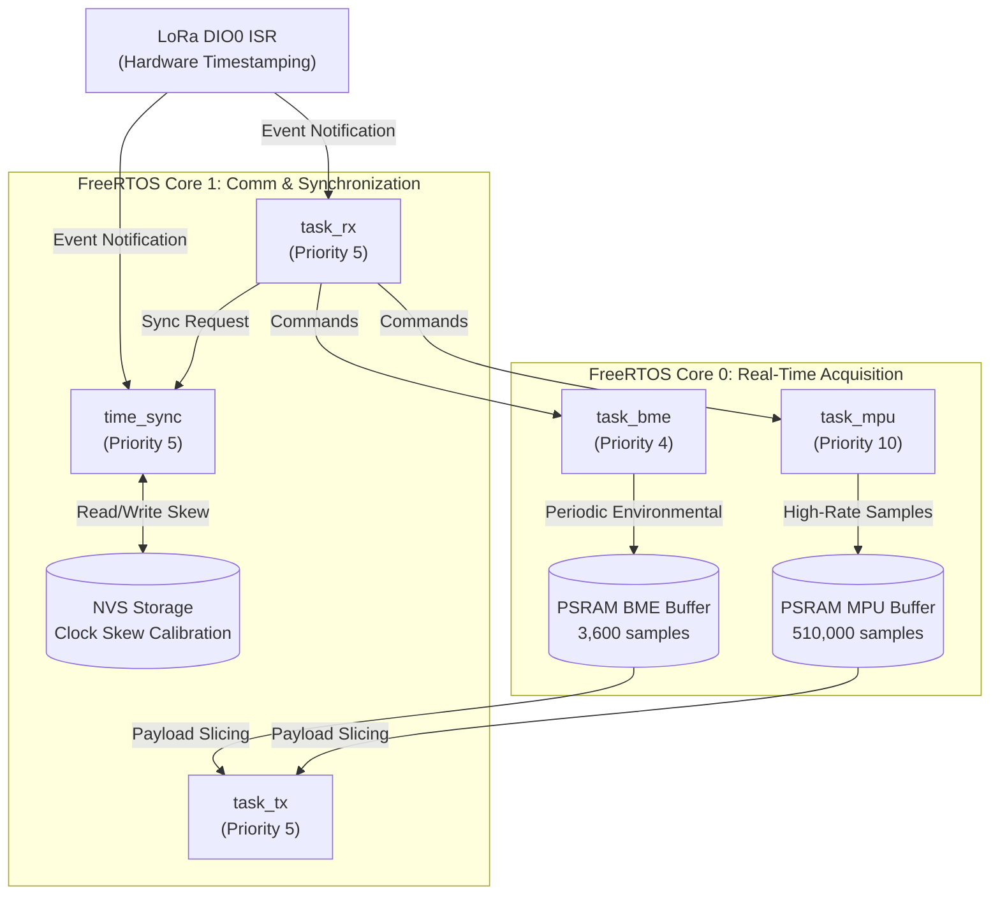

# 📡 TEG-NODE: Smart Sensor Node for Structural Health Monitoring (SHM)

[](https://docs.espressif.com/projects/esp-idf/en/latest/)
[](https://platformio.org/)
[-blue.svg?logo=espressif&logoColor=white)](https://www.espressif.com/en/products/socs/esp32-s3)
[-green.svg)](https://en.wikipedia.org/wiki/LoRa)
[](#network-architecture)
[](LICENSE)

Firmware for a distributed, low-cost **Smart Wireless Sensor Node** designed for **Structural Health Monitoring (SHM)** of civil infrastructure. Built upon an **ESP32-S3** microcontroller with **Octal PSRAM**, an **MPU-6050** 6-DoF IMU, a **BME280** environmental sensor, and an **Ai-Thinker RA-02 (SX1278)** LoRa transceiver.

This node operates as part of a **wireless star-topology network** centrally orchestrated by a Raspberry Pi-based gateway ([TEG-GATEWAY](https://github.com/jorgedrp/TEG-GATEWAY)).

---

## 📑 Table of Contents

- [Overview](#-overview)
- [Key Features](#-key-features)
- [System Architecture](#-system-architecture)
- [Hardware & Pinout](#-hardware--pinout)
- [Firmware Architecture](#-firmware-architecture)
- [Operating Modes](#-operating-modes)
- [Time Synchronization & Clock Skew Calibration](#-time-synchronization--clock-skew-calibration)
- [Communication Protocol](#-communication-protocol)
- [Project Structure](#-project-structure)
- [Getting Started](#-getting-started)
- [Configuration](#-configuration)
- [Related Repositories](#-related-repositories)
- [Academic Context & Credits](#academic-context--credits)
- [License](#-license)

---

## 🌟 Overview

Civil infrastructure (bridges, buildings, dams, towers) requires continuous or event-driven vibration and environmental monitoring to assess structural integrity over time. Commercial SHM systems are often cost-prohibitive, wired, or lack microsecond-level synchronization across wireless nodes.

**TEG-NODE** solves these challenges by providing:
1. **High-frequency synchronous inertial acquisition** (accelerations and angular rates up to 1 kHz).
2. **Environmental telemetry** (ambient temperature, relative humidity, barometric pressure) to correlate modal shifts with environmental factors.
3. **Sub-millisecond wireless time synchronization** via a 4-timestamp RTT protocol and NVS-stored linear clock skew calibration.
4. **Massive onboard PSRAM buffering** for multi-minute uninterrupted vibration recording and pre-trigger event capture.
5. **Reliable long-range LoRa transmission** with Automatic Repeat Request (ARQ) packet recovery.

```
       ┌──────────────────────────────────────────────────────────┐
       │             Central Orchestrator / Gateway               │
       │           (Raspberry Pi + LoRa Master Node)              │
       │          https://github.com/jorgedrp/TEG-GATEWAY         │
       └────────────────────────────┬─────────────────────────────┘
                                    │ LoRa 433 MHz (Star Network)
        ┌───────────────────────────┼───────────────────────────┐
        ▼                           ▼                           ▼
 ┌──────────────┐            ┌──────────────┐            ┌──────────────┐
 │   TEG-NODE   │            │   TEG-NODE   │            │   TEG-NODE   │
 │ (ID: 0x10)   │            │ (ID: 0x20)   │            │ (ID: 0x40)   │
 │   ESP32-S3   │            │   ESP32-S3   │            │   ESP32-S3   │
 │  MPU + BME   │            │  MPU + BME   │            │  MPU + BME   │
 └──────────────┘            └──────────────┘            └──────────────┘
```

---

## 🚀 Key Features

* **Multi-Core FreeRTOS Architecture**: Dedicated task execution pinned across ESP32-S3 Core 0 (real-time sampling & sensor acquisition) and Core 1 (LoRa communication, protocol handling, time synchronization).
* **High-Capacity PSRAM Buffering**: Utilizes 8 MB Octal PSRAM (`MALLOC_CAP_SPIRAM`) to allocate a circular buffer holding **over 510,000 MPU samples (~7.5 MB)** and **3,600 BME environmental records**.
* **Dual Operating Modes**:
  * **Time-Scheduled Acquisition**: Coordinated sampling across all distributed nodes for a fixed duration at configurable rates (100 Hz to 1000 Hz).
  * **Event-Triggered Acquisition**: Continuous circular monitoring with programmable acceleration thresholds, pre-trigger history buffer preservation, and peer event propagation.
* **Precision Time Synchronization**:
  * Hardware-assisted timestamping captured via LoRa `DIO0` rising-edge ISR (`esp_timer_get_time()`).
  * 4-Timestamp Two-Way Time Transfer ($T_1, T_2, T_3, T_4$) filtering out outliers.
  * Linear regression-based **clock skew compensation** saved in Non-Volatile Storage (NVS).
* **Multi-Channel LoRa Communication**: Dynamic frequency & modulation switching between a shared low-rate **Signaling Channel** (SF10) and dedicated high-throughput **Data Channels** (SF7).
* **Packet Loss Detection & ARQ**: Master-driven sequence number verification with automated packet retransmission requests (`DATA_LOSS` / retransmission cycle).
* **Visual Status Feedback**: Integrated WS2812 RGB addressable LED via ESP32 RMT peripheral providing instant node status (Standby, Sampling, Event Armed, Syncing).

---

## 🛠 Hardware & Pinout

### Component List
| Component | Model | Description / Interface |
|---|---|---|
| **MCU** | ESP32-S3-WROOM-1 / DevKitC-1 | Xtensa dual-core 32-bit LX7, 16MB Flash, 8MB Octal PSRAM |
| **Inertial Sensor** | MPU-6050 (GY-521) | 3-axis Accelerometer & 3-axis Gyroscope (I2C) |
| **Environmental** | BME280 (GY-BME280) | Temperature, Relative Humidity, Barometric Pressure (I2C) |
| **Transceiver** | Ai-Thinker RA-02 | Semtech SX1278 433 MHz LoRa transceiver (SPI + DIO0 IRQ) |
| **RGB Indicator** | WS2812B (Onboard) | Single-wire RMT-driven RGB status LED |

### GPIO Pinout Matrix
```
                         ESP32-S3 DevKitC-1
                     ┌───────────────────────┐
   (I2C SDA)  GPIO 1 ┤                       ├ GPIO 48 (WS2812 RGB LED)
   (I2C SCL)  GPIO 2 ┤                       ├ GPIO 47 (LoRa DIO0 - IRQ)
                     │                       ├ GPIO 45 (LoRa RESET)
                     │                       ├ GPIO 42 (LoRa SCK / CLK)
                     │                       ├ GPIO 41 (LoRa MISO)
                     │                       ├ GPIO 40 (LoRa MOSI)
                     │                       ├ GPIO 39 (LoRa NSS / CS)
                     └───────────────────────┘
```

| Function | Pin (ESP32-S3) | Connected Peripheral | Protocol / Role |
|---|---|---|---|
| **I2C SDA** | `GPIO 1` | MPU-6050 / BME280 | I2C Data (400 kHz Fast Mode) |
| **I2C SCL** | `GPIO 2` | MPU-6050 / BME280 | I2C Clock (400 kHz Fast Mode) |
| **SPI CS / NSS** | `GPIO 39` | SX1278 (RA-02) | Chip Select (Active Low) |
| **SPI MOSI** | `GPIO 40` | SX1278 (RA-02) | Master Out Slave In |
| **SPI MISO** | `GPIO 41` | SX1278 (RA-02) | Master In Slave Out |
| **SPI SCK** | `GPIO 42` | SX1278 (RA-02) | Serial Clock |
| **LoRa RESET** | `GPIO 45` | SX1278 (RA-02) | Module Hardware Reset |
| **LoRa DIO0** | `GPIO 47` | SX1278 (RA-02) | RxDone / TxDone Interrupt (Hardware Time Capture) |
| **RGB LED** | `GPIO 48` | Onboard WS2812 | RMT Peripheral Status Indicator |

> **I2C Addresses**: MPU-6050: `0x68` (AD0 to GND) | BME280: `0x76` (SDO to GND)

---

## 🧠 Firmware Architecture

The firmware is developed in native C using **ESP-IDF** (v5.x) and **FreeRTOS**:



### Visual Status Feedback (LED Strip)
| Color | Mode / State | Description |
|---|---|---|
| 🔵 **Blue** | **Standby Mode** | Idle, listening for commands on signaling channel. |
| 🔴 **Red** | **Time Mode** | Actively sampling vibration and environmental data. |
| 🟢 **Green** | **Event Mode** | Armed in circular buffer mode; waiting for vibration trigger. |
| 🟡 **Yellow** | **Clock Synchronization** | Performing RTT round-trip sync or skew calibration with Gateway. |

---

## ⚙️ Operating Modes

### 1. Standby Mode (`MODO_STANDBY`)
Default low-power state. The node listens on the primary LoRa signaling frequency (`433.175 MHz`) for commands from the gateway.

### 2. Time-Scheduled Mode (`MODO_TIEMPO`)
Synchronous acquisition across the network. 
* Initiated by the gateway broadcast command specifying duration ($T$ seconds) and sampling interval ($\Delta t$).
* Both the MPU-6050 (inertial) and BME280 (environmental) are sampled synchronously.
* Upon acquisition completion, data is packed into 243-byte LoRa packets and transferred to the gateway.

### 3. Event-Triggered Mode (`MODO_EVENTO`)
Autonomous shock and vibration detection.
* The MPU-6050 continuously writes into the circular PSRAM buffer.
* If any axis acceleration exceeds the dynamically set threshold ($\pm g$), an event trigger fires:
  1. The node transmits a broadcast `EVENT_DETECTED` signal to immediately notify the gateway and wake up neighboring nodes.
  2. A pre-trigger buffer (preserving pre-event structural state) is locked.
  3. Continuous recording proceeds for the configured post-event duration.
  4. The gateway downloads the captured event data block.

---

## ⏱ Time Synchronization & Clock Skew Calibration

Precise modal analysis (such as Operational Modal Analysis - OMA) across distributed wireless nodes requires microsecond-level synchronization.

```
       Node (ESP32-S3)                              Gateway (Raspberry Pi)
              │                                                │
       t1 ────┼────── CMD_TIME_SYNC_REQUEST ──────────────────►│ t2
              │                                                │
              │                                                │
       t4 ◄───┼────── CMD_TIME_SYNC_RESPONSE (t2, t3) ─────────┼ t3
              │                                                │
```

1. **Hardware Timestamping**: When the LoRa module receives a sync packet, the `DIO0` line triggers an immediate hardware interrupt (`lora_dio0_isr_handler`), capturing $T_4$ with microsecond accuracy via `esp_timer_get_time()`.
2. **Round-Trip Time (RTT) Filtering**: The node sends `NUM_SYNC_ATTEMPTS` (20 attempts), evaluates the round-trip delay $\text{RTT} = (T_4 - T_1) - (T_3 - T_2)$, and selects the best low-jitter samples.
3. **Clock Skew Compensation**: Linear regression over multiple time samples computes the local crystal frequency offset (`clock_skew`) and absolute time offset (`clock_offset_us`).
4. **NVS Persistence**: Calibrated skew coefficients are saved to Non-Volatile Storage (NVS) across power cycles.

---

## 📦 Communication Protocol

### LoRa Radio Parameters
* **Signaling Channel (Channel 6)**: Frequency = `433.175 MHz`, Bandwidth = `125 kHz`, Spreading Factor = `SF10`, Coding Rate = `4/8`, CRCs Enabled.
* **Data Channels (e.g. Channel 3)**: High-speed modes using `SF7`, Bandwidth up to `250 kHz` for rapid PSRAM data offloading.

### Control Frame Structure (5 Bytes)
```
┌──────────────┬──────────────┬──────────────┬──────────────┬──────────────┐
│  Target ID   │   Command    │    Arg 1     │    Arg 2     │    Arg 3     │
│   (1 Byte)   │   (1 Byte)   │   (1 Byte)   │   (1 Byte)   │   (1 Byte)   │
└──────────────┴──────────────┴──────────────┴──────────────┴──────────────┘
```

### Data Packet Structure (243 Bytes Payload)
```
┌──────────────┬──────────────┬──────────────┬──────────────────────────────────────────┐
│  DevID | Sen │ Packet Num L │ Packet Num H │          Packed Sensor Records           │
│   (1 Byte)   │   (1 Byte)   │   (1 Byte)   │       (16 MPU frames @ 15B each)         │
└──────────────┴──────────────┴──────────────┴──────────────────────────────────────────┘
```

* **MPU-6050 Record (15 Bytes)**: `timestamp_l (1B)`, `timestamp_m (1B)`, `timestamp_h (1B)`, `ax (2B)`, `ay (2B)`, `az (2B)`, `gx (2B)`, `gy (2B)`, `gz (2B)`.
* **BME-280 Record (15 Bytes)**: `timestamp_l (1B)`, `timestamp_m (1B)`, `timestamp_h (1B)`, `temperature (4B float)`, `pressure (4B float)`, `humidity (4B float)`.

---

## 📂 Project Structure

```
TEG-NODE/
├── CMakeLists.txt              # Root CMake build configuration
├── platformio.ini              # PlatformIO project configuration (ESP-IDF)
├── sdkconfig.defaults          # ESP32-S3 Flash (16MB) and Octal PSRAM (8MB) settings
├── include/                    # Header files and register definitions
│   ├── bme280.h                # BME280 sensor driver headers & structs
│   ├── clock.h                 # Time synchronization & regression calibration
│   ├── i2c.h                   # ESP-IDF I2C master driver configuration
│   ├── lora.h                  # SX1278 LoRa registers, configs & node IDs
│   ├── mpu6050.h               # MPU6050 driver, calibration & data structures
│   └── spi.h                   # Hardware SPI master bus setup
└── src/                        # Source implementations
    ├── CMakeLists.txt          # Component registration
    ├── bme280.c                # BME280 compensation formulas & I2C reads
    ├── clock.c                 # Two-way sync, linear regression & NVS flash storage
    ├── i2c.c                   # I2C bus initialization (400 kHz)
    ├── lora.c                  # SX1278 SPI driver, state machine & packet handlers
    ├── main.c                  # App entry point, FreeRTOS tasks, event handling & ARQ
    ├── mpu6050.c               # MPU-6050 initialization and 6-DoF readout
    └── spi.c                   # SPI master driver implementation
```

---

## 🚦 Getting Started

### Prerequisites
* [PlatformIO IDE](https://platformio.org/) (recommended as VSCode extension or CLI) OR native [ESP-IDF v5.x](https://docs.espressif.com/projects/esp-idf/en/latest/).
* USB-C cable connected to the ESP32-S3 development board.

### 1. Clone the Repository
```bash
git clone https://github.com/jorgedrp/TEG-NODE.git
cd TEG-NODE
```

### 2. Configure Node ID & Sensor Offsets
Open `include/lora.h` and select the target Device ID:
```c
#define DEV_ID  0x10  // Set to 0x10, 0x20, 0x30, or 0x40
```
*(Ensure calibration offsets match the physical node sensor).*

### 3. Build the Firmware
Using PlatformIO CLI:
```bash
pio run
```

### 4. Flash and Monitor
```bash
pio run --target upload --target monitor
```

---

## 🔧 Configuration

### Sampling Rate vs Filter Settings
Configured automatically during the `CONFIG` command from the master gateway:
| Rate (`rate` ms) | Sampling Frequency | MPU-6050 DLPF Setting |
|---|---|---|
| `1` ms | 1000 Hz | DLPF Disabled (260 Hz bandwidth) |
| `2` ms | 500 Hz | DLPF Disabled |
| `4` ms | 250 Hz | DLPF 94 Hz Bandwidth |
| `5` ms | 200 Hz | DLPF 94 Hz Bandwidth |
| `10` ms | 100 Hz | DLPF 44 Hz Bandwidth |

---

## 🔗 Related Repositories

* 🖥️ **Central Gateway / Master Node**: [TEG-GATEWAY](https://github.com/jorgedrp/TEG-GATEWAY) — Raspberry Pi orchestrator firmware, star network controller, data collection engine, and central storage.

---

## Academic Context & Credits

This project was developed as part of an **Undergraduate Degree Thesis (Trabajo Especial de Grado - TEG)** at **Universidad Central de Venezuela (UCV)**, Faculty of Engineering.

- **Author:** Jorge D. Ramírez. P. ([@jorgedrp](https://github.com/jorgedrp))

---

## 📄 License

This project is licensed under the MIT License - see the [LICENSE](LICENSE) file for details.
